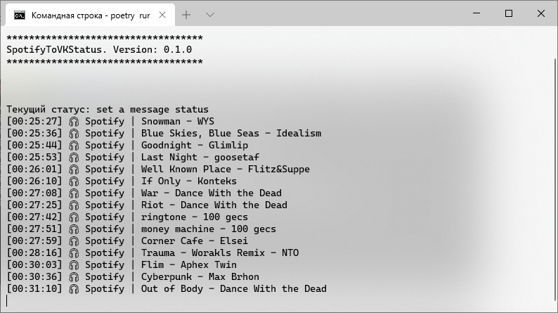

<p align="center">
  
  <p align="center"><b>Утилита</b> для трянсляции прослушиваемых треков из Spotify в статус ВКонтакте.</p>
</p>


#
# Установка

1. Склонируйте репозиторий (или просто скачайте [его](https://github.com/keyzt/SpotifyToVKStatus/archive/master.zip)) и перейдите в директорию с проектом.

	```console
	git clone https://github.com/soround/SpotifyToVKStatus.git
	cd SpotifyToVKStatus
	```

2. Установите необходиме зависимости:
	- Используя **Poetry**: ```poetry install --no-dev```
	- Используя **pip**: ```pip install -r requirements.txt```

3. Создайте в корне директории проекта файл конфигурации `.env`, и настройте его согласно `env.example`.
	- Создайте свое приложение [тут](https://developer.spotify.com/dashboard/applications).
	- Заполните поля в конфиге согласно вашим значениям.

# Использование

- Обычный запуск:
	```console
	python -m app
	```
- Запуск при помощи **Poetry**:
	```console
	poetry run python -m app
	```

	
